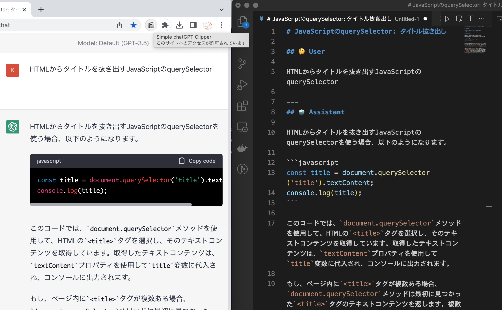

# Simple ChatGPT Clipper

This Chrome extension is a tool that allows you to easily copy messages displayed on the ChatGPT website to your clipboard. ChatGPT responses are converted to Markdown format, while user input remains as plain text.

**Note**: This extension is compatible with the ChatGPT site as of March 21, 2023. It may not work if the site layout is updated. As for updating the extension, it depends on the mood at the time, so no promises can be made.

### Installation

1.  Download this project from Github.
2.  Open Google Chrome and go to [chrome://extensions/](chrome://extensions/).
3.  Enable "Developer mode" in the top right corner.
4.  Click on "Load Unpackaged" and select the `/chrome-extension` folder under the downloaded folder.
5.  The extension is now enabled.
6.  Click on the Extensions icon on the toolbar
7.  Pin the Simple ChatGPT Clipper. The icon will now appear on your toolbar.

### Usage

1.  Type your question on ChatGPT's website.
2.  Click the Simple ChatGPT Clipper icon.
3.  A Markdown-formatted answer will be copied to your clipboard.

### License

This project is released under the MIT license. [Turndown](https://github.com/mixmark-io/turndown/blob/master/LICENSE) is used to generate Markdown. ChatGPT is used for other source code generation.

---
Japanese
# Simple ChatGPT Clipper

このChrome拡張機能は、ChatGPTのWebサイトから表示されているメッセージを簡単にクリップボードにコピーできるようにするツールです。ChatGPTの回答はMarkdown形式に変換され、ユーザの入力はテキストのままコピーされます。

**注意**: この拡張機能は、2023年3月21日時点のChatGPTのサイトに対応しています。サイトのレイアウトが更新されると動作しなくなる可能性があります。拡張機能の更新に関しては、その時の気分次第で決まるため、約束はできません。

## インストール

1.  Githubからこのプロジェクトをダウンロードします。
2.  Google Chromeを開き、[chrome://extensions/](chrome://extensions/)にアクセスします。
3.  右上の「デベロッパーモード」を有効にします。
4.  「パッケージされていない拡張機能を読み込む」をクリックし、ダウンロードしたフォルダ内の `/chrome-extension` フォルダを選択します。
5.  拡張機能が有効になります。
6.  ツールバーの拡張機能アイコンをクリックします。
7.  Simple ChatGPT Clipperをピン留めします。これでツールバーにアイコンが表示されます。

## 使い方

1.  ChatGPTのWebサイトで質問を入力します。
2.  Simple ChatGPT Clipperのアイコンをクリックします。
3.  クリップボードにMarkdown形式の回答がコピーされます。

## ライセンス

このプロジェクトはMITライセンスの下で公開されています。[Turndown](https://github.com/mixmark-io/turndown/blob/master/LICENSE) を使用しています。その他ソースコードの生成にChatGPTを使用しています。
